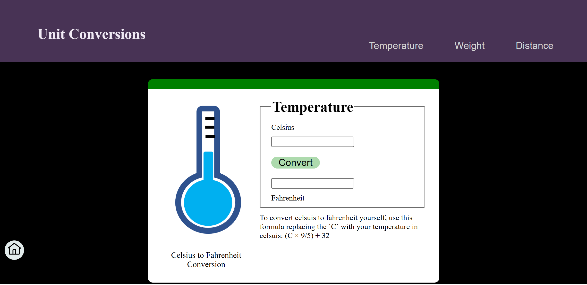
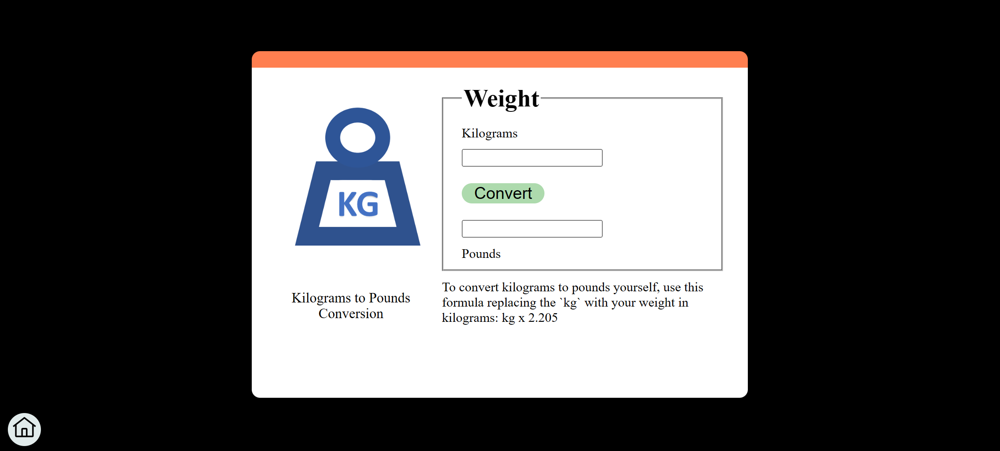
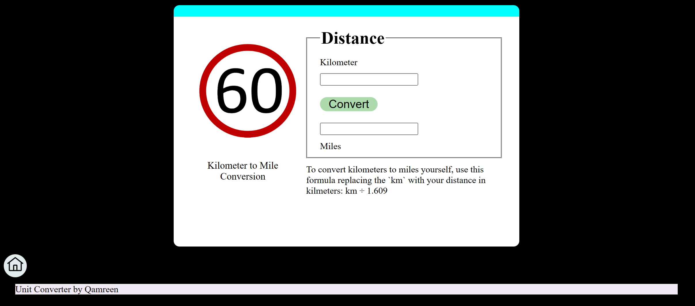

# Unit Converter

This is a simple web application that allows you to convert units of temperature, weight, and distance. It provides conversions from Celsius to Fahrenheit, kilograms to pounds, and kilometers to miles.

## Features

- Temperature Conversion: Converts Celsius to Fahrenheit.
- Weight Conversion: Converts kilograms to pounds.
- Distance Conversion: Converts kilometers to miles.

## Usage

1. Open the `index.html` file in a web browser.
2. Click on the respective buttons for temperature, weight, or distance conversion.
3. Enter the value in the input field for the unit you want to convert.
4. Click the "Convert" button.
5. The converted value will be displayed in the corresponding output field.

## Formula

- Temperature Conversion: To convert Celsius to Fahrenheit, use the formula: (C × 9/5) + 32.
- Weight Conversion: To convert kilograms to pounds, use the formula: kg x 2.205.
- Distance Conversion: To convert kilometers to miles, use the formula: km ÷ 1.609.

## Navigation

- Use the top menu buttons to navigate between different conversion sections.
- Click the home icon button to go back to the main page.

## Credits

- The images used in this application are sourced from [IBMDeveloperSkillsNetwork](https://developer.ibm.com/skills-network/).
- This application was created as part of the IBM Hands-On Lab.

## Author

This Unit Converter application was created by Qamreen.

Feel free to customize and enhance the code to meet your specific requirements!

